# play-with-graph 玩转图论算法
##  第一个问题关于图的表示

# 图的表示
	
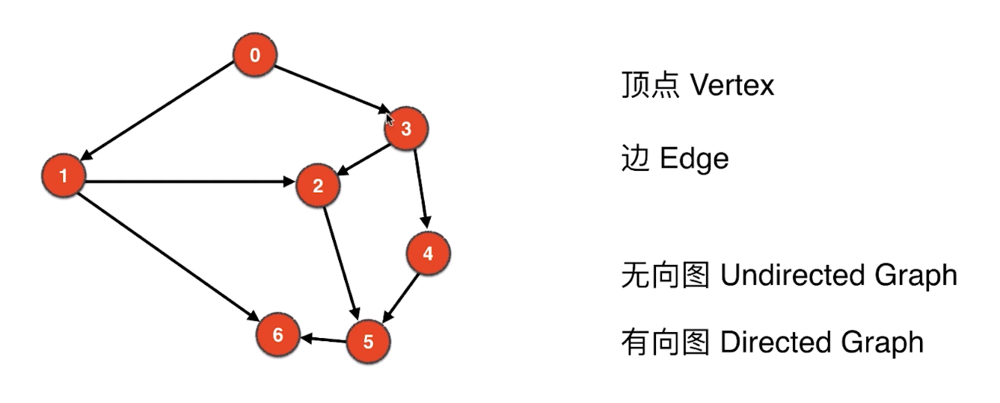
## 社交网路

## 图的分类算法
无向无权图 
无向有权图 
有向无权图 
有向有权图

# 图的基本概念
## 	无向无权图

没有自环边，没有平行边， 称为简单图

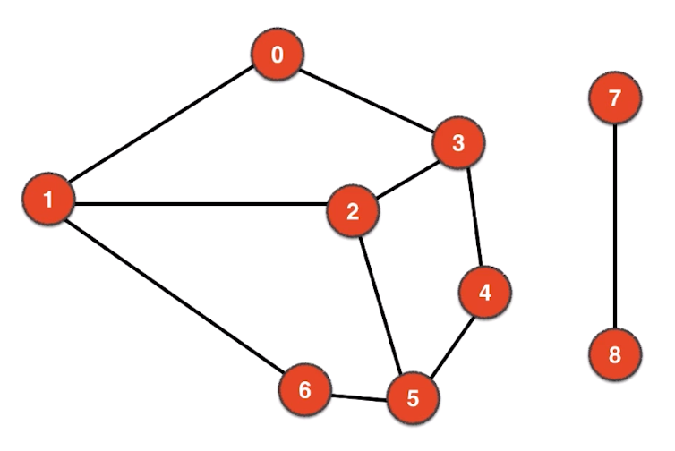

### 联通分量 
	一个图的所有节占不一定全部相连 
	一个图可能有多个联通分量

###  无环图 
	树是一种无环图。无环图不一定是树
	联通的无环图就是树

## 包含所有顶占边数V·1， 一定是联通图的生成树吗？

	不是！

###  一个图一定有生成树吗？

	没有

### 一个顶点的度 

##  邻接矩阵

[实现code](https://github.com/HuichuanLI/play-with-graph-algorithme/blob/master/src/AdjMatrix.java)

复杂度

	可以优化空间复杂度 O(V2)
	如果一个图有3000个节点
	空间：5999vs3000^2约1000万 
	求相邻顶点．degree(v)vs3000

## 稀疏图和稠密图

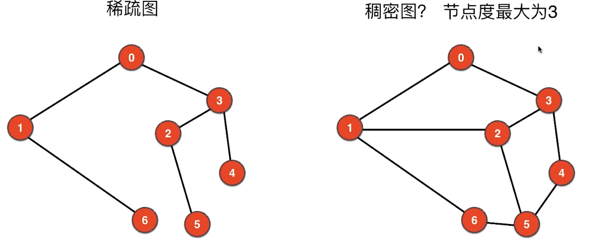
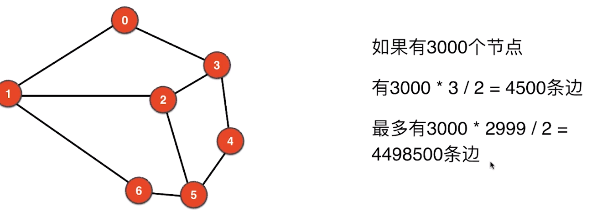
稠密图

平均每个度比较最大的度
## 邻接表
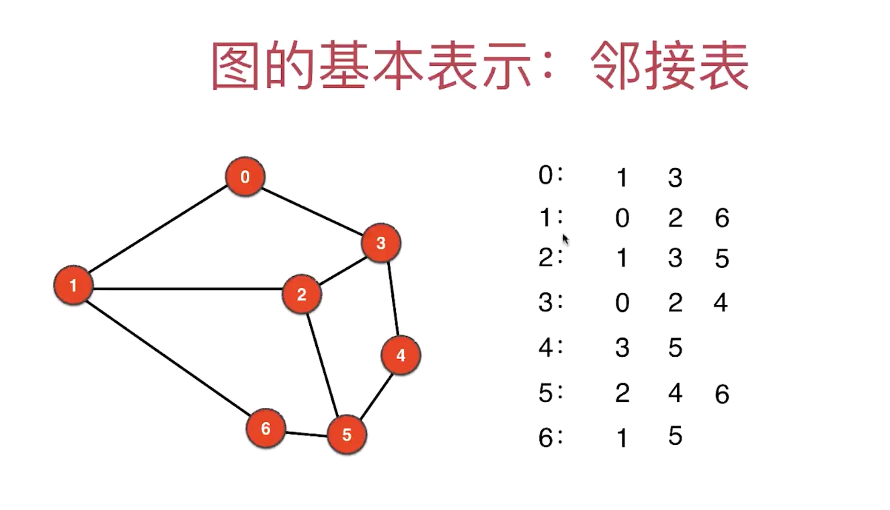
[实现code](https://github.com/HuichuanLI/play-with-graph-algorithme/blob/master/src/AdjList.java)

## 空间复杂度
	空间复杂度，O(V+E)
	如果是 树的话 O（2E+1）= O(E)
	如果是完全图的话 O（v*(V-1)/2 + E）= O(E)
	但是 不能写O(E) 如果不联通

## 时间复杂度：
建图：O(E*V)  和邻接矩阵 相差了v
	
看两点是否相邻 ：O(degree(v))  原来是O(1)

求一个点的相邻节点 : O(degree(v)) 只需要遍历所有相邻节点个数
	
快速查重 
	
快速查看两点是否相邻
	
不要使用链表 
	
hash 表 HashSet O(1)
	
红黑树 TreeSet O(logv)
	
因为红黑树 考虑到元素之间的顺序性，为了保证TreeSet，为了使得结果相对可视化。

红黑树相对于hash表内存空间相对于少。

时间复杂度虽然会增加 o(1) < o(logn) < o(n) 比如 100w 1< 20 < 1000000

算法优化 使用红黑树而对于java使用[TreeSet](https://github.com/HuichuanLI/play-with-graph-algorithme/blob/master/src/AdjSet.java)

## 算法复杂度

我们可以看出来邻接表，在其他方面都是优于其他的表示方法。

所以我们接下来，都是使用邻接表。基于TreeSet。

# 图的遍历

	
图是一种数据结构 每种数据结构，都必须有“遍历"的方式

比如树的遍历: 

很多算法本质就是遍历，其实看算法中是否有关。

其实80%的面试问题都可以解决了。

图其实就是比树要解决，重复遍历的问题。每次需要记录，那个节点被遍历。

图论不考虑非递归算法。

其实图论算法都是从树的遍历的引申，其实很像，其实底层实现很想。

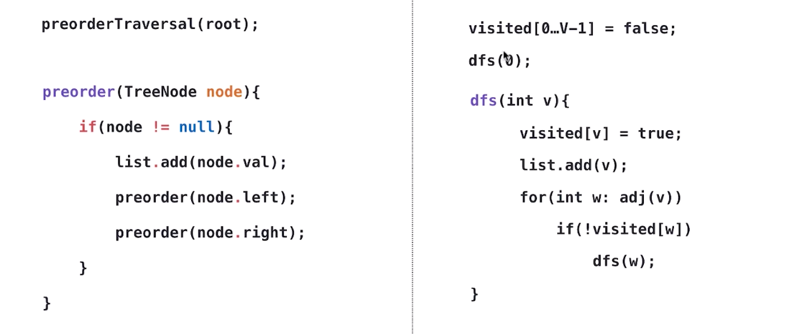

其实对应n叉树，很像。

代码[DFS](https://github.com/HuichuanLI/play-with-graph-algorithme/blob/master/src/GraphDfs.java)

回归二叉树的遍历

类似的 我们可以推导后续遍历

        

复杂度 O（V+E）

关于优先遍历的应用：二分图

非递归的手法，深度优先遍历，其实很难，邻接矩阵的深度优先遍历

邻接表的深度优先遍历，其实一样。无非就是改变接口，但是注意时间复杂度: O(V^2)

因为这个过程，我们依然要遍历所有顶点的所有邻边。但是遍历一个顶点的所有邻边的时候，要遍历所有的顶点，复杂度是O(V)的，而非O(degree(v))的。

因此，整体，遍历所有顶点的所有邻边，需要的时间复杂度是O(V^2)的。

代码实现 : [ADJDFS](https://github.com/HuichuanLI/play-with-graph-algorithme/blob/master/src/adjMatrixDFS.java)

使用图的接口 : [Interface](https://github.com/HuichuanLI/play-with-graph-algorithme/blob/master/src/GraphInterface.java)

大家可以看到，我们写的DFS算法类，其实封装的非常好，只需要简单的将类中传入的所有Graph类型（对应第二章中AdjSet的实现），修改为AdjMatrix，就可以完全正确地执行针对链接矩阵AdjMatrix的深度优先遍历了。

关于图的非递归的深度优先遍历

首先先复习一下，使用栈，树的非递归的实现, 如 Leetcode 144 

    // 深度优先遍历的非递归实现，需要使用一个栈
    Stack&lt;TreeNode&gt; stack = new Stack&lt;TreeNode&gt;();
    // 栈中首先压入根节点root
    stack.push(root);
    
    // 只要栈不为空，说明还有未被遍历的节点
    while(!stack.empty()){

    // 遍历栈顶元素
    TreeNode curNode = stack.pop();
    // 在这个例子中，遍历的方式是将该节点的值放入一个线性表res中
    res.add(curNode.val); 

    // 之后，把当前节点的左右孩子压入栈中，等待后续的遍历
    if(curNode.right != null)
        stack.push(curNode.right);
    if(curNode.left != null)
        stack.push(curNode.left);
    }
    
那么对于这种来其实一样。

实现代码：[code](https://github.com/HuichuanLI/play-with-graph-algorithme/blob/master/src/GraphDFSnr.java)

注意这里的结果和以前的不一样

递归 ：
    [0, 1, 3, 2, 6, 5, 4 ] 

非递归 ： 
    [0, 2, 1, 3, 5, 4, 6]

其实很简单。因为非递归的过程，我们是将一个顶点的相邻顶点压入栈中，取出的时候，是反向的；而递归没有这个问题，我们会按照adj(v)返回的列表的顺序，依次做深度优先遍历。+在这里，对此有疑问的同学，强烈建议实际对这两个程序进行一下单步跟踪，仔细理解一下，为什么会产生不一样的结果？通过但不跟踪，了解算法的每一步在做什么，每一步变量都发生了怎样的变化，怎样一点一点得到了最终的结果，这可是学习算法的重要方式哦。很多时候，顿悟，就发生在这个过程中：）

当然了，其实，这两个结果，都是图的深度优先遍历的结果。

# 图的优先遍历的应用

## 无向图的联通分量

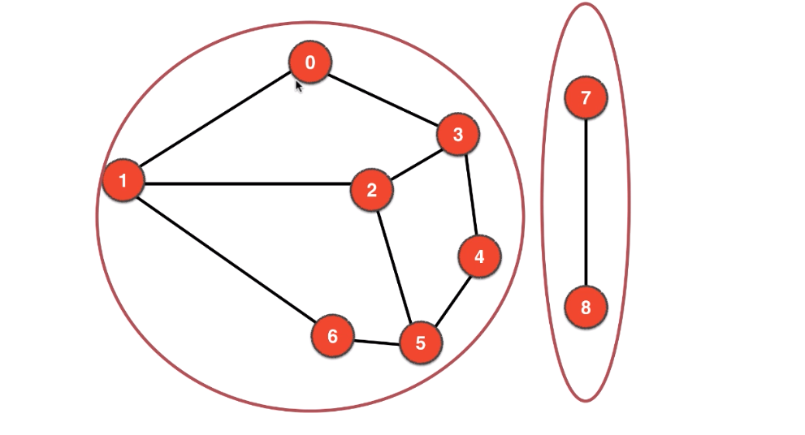 

代码：可以通过深度优先遍历，查看哪些是联通分量

[code](https://github.com/HuichuanLI/play-with-graph-algorithme/blob/master/src/CC.java)

## 路径问题 

两点在同一个联通分量， 意味着两点间有路径

路径怎么求 

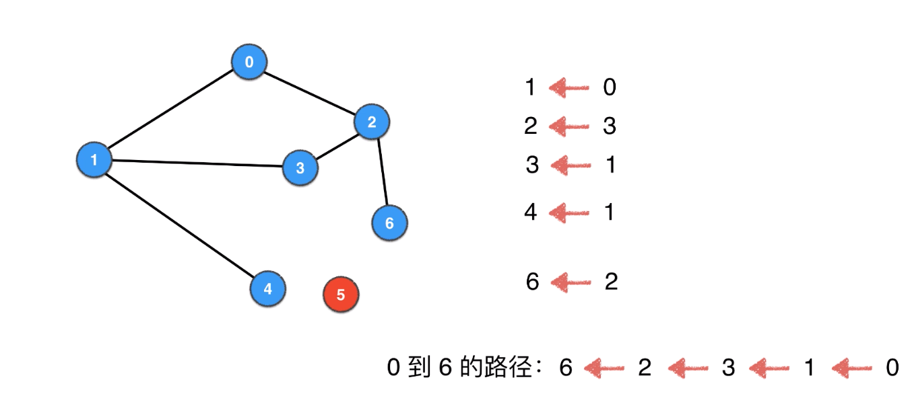 

对应这种问题，我们向对来说，只能求从0到那个节点有路径，从某个点出发，到任意位置的路径，单源路径。

[SingleSourcePath](https://github.com/HuichuanLI/play-with-graph-algorithme/blob/master/src/SingleSourcePath.java)

那么我们现在只是解决了单源问题，但是没解决多源问题，所以如何解决所有点路径的问题。

我们其实全部遍历点就好了，创建一个SingleSourcePath 数组

[AllPairsPath](https://github.com/HuichuanLI/play-with-graph-algorithme/blob/master/src/AllPairsPath.java)

对于递归提前结束，没必要全部都遍历

[Path](https://github.com/HuichuanLI/play-with-graph-algorithme/blob/master/src/Path.java)

## 检测无向图中的环

[CycleDetection](https://github.com/HuichuanLI/play-with-graph-algorithme/blob/master/src/CycleDetection.java)

在这一小节，我们实现了无向图的环检测代码。那么现在能不能实现一个简单的算法逻辑，来判断，给定的一张图，是否是一棵树?

必须保证图是联通的，同时没有环，才能说明这张图是一棵树。

在这一章，我们已经封装了求解图的连通分量的 CC 类，和环检测 CycleDetection 类,其实就可以判断一个图是不是树。

## 二分图检测

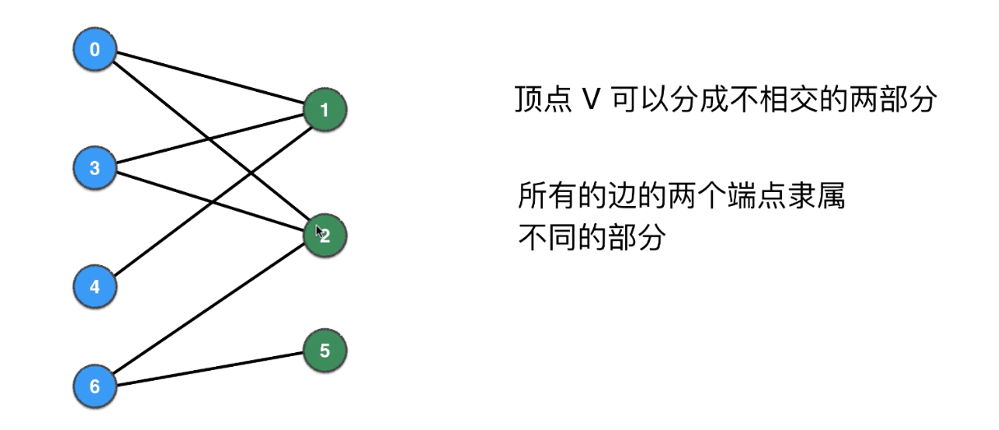 

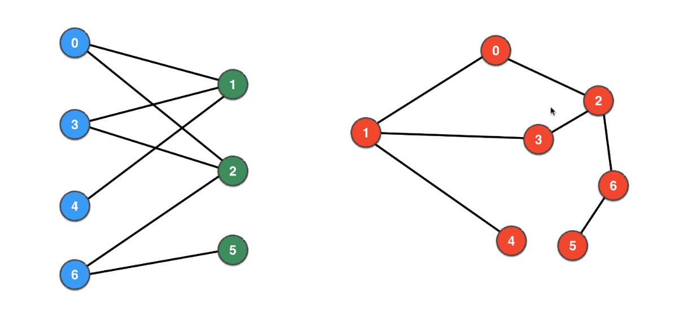 

左右两边是一样的，其实无非就是染色。

 
 
[BiparitionDecetion](https://github.com/HuichuanLI/play-with-graph-algorithme/blob/master/src/BipartitionDecetion.java)

同构图

NP 难 不能再多项式的问题是解决不了，但是无法证明是指数复杂度解决。

平面图

# 广度优先遍历

回顾树的优先遍历，其实就是一个队列，实现每次将这个节点的孩子节点放入队列中，最终当队列空了，就说明
树已经全部遍历过。对于一个节点，将所有的节点都遍历一边。

[BFS](https://github.com/HuichuanLI/play-with-graph-algorithme/blob/master/src/GraphBFS.java)

复杂度 O(V+E)

和深度优先遍历是一样的，如果是联通图的情况就是 O(E)

无非就是顺序不一样。

# 广度优先遍历应用

## 路径问题

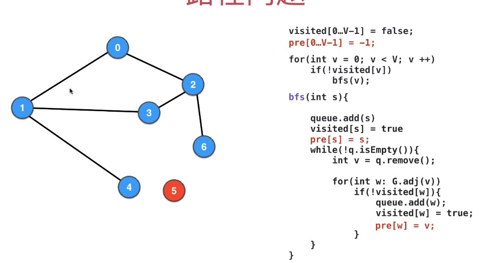 

DFS : 0->6:[0, 1, 3, 2, 6]

BFS : 0->6:[0, 2, 6]

[SingleSourcePathBFS](https://github.com/HuichuanLI/play-with-graph-algorithme/blob/master/src/SingleSourcePathBFS.java)

## 使用 BFS 解决联通分量问题

如果大家实际尝试一下，就会发现，这其实是非常简单的，我们要做的事情，近乎就是讲 dfs 函数替换成 bfs 函数而已。

注意，以下代码沿用我们在上一章第三小节的代码风格，visited数组是一个整型数组，-1 代表没有遍历，非负整数代表对应的连通分量的id。

    // 使用 BFS 解决无向图的联通分量问题
    public class CC {

    private Graph G;
    private int[] visited;
    private int cccount = 0;

    public CC(Graph G){

        this.G = G;
        visited = new int[G.V()];
        for(int i = 0; i < visited.length; i ++)
            visited[i] = -1;

        for(int v = 0; v < G.V(); v ++)
            if(visited[v] == -1){
                // 只是这里调用 bfs 而已
                bfs(v, cccount);
                cccount ++;
            }
    }

代码如下：

[CCBfs](https://github.com/HuichuanLI/play-with-graph-algorithme/blob/master/src/CCBfs.java)

## 使用 BFS 求解环检测问题

可以回忆一下，在上一章，我们使用 DFS 解决了环检测问题。同理的，BFS 也可以解决环检测问题：）

和 DFS 的思路一样，大家可以回忆一下。使用 DFS 做环检测，只需要看到某一个顶点之前曾经遍历过，同时不是当前顶点的前一个顶点，就说明我们找到了一个环。

[CycleDecetionBFS](https://github.com/HuichuanLI/play-with-graph-algorithme/blob/master/src/CycleDecetionBFS.java)

## 使用 BFS 解决二分图检测问题

可以回忆一下，在上一章，我们使用 DFS 解决了二分图检测问题。同理的，BFS 也可以解决环检测问题：）

和 DFS 的思路一样，大家可以回忆一下。使用 DFS 做二分图检测，需要不断对没有遍历过的顶点进行染色，对遍历过的顶点，查看是否矛盾。如果产生矛盾，即某条边的两个端点颜色一样，则说明整张图不可能是二分图，否则，整张图就是二分图。

在这里，我首先强烈建议大家自己尝试基于 BFS，设计一个算法类，解决二分图检测问题。整个类的接口，应该和我们在学习 DFS 时设计的 BipartitionDetection 类是一样的，只不过，内部实现是使用 BFS 而不是 DFS：）

[BipartitionDecetionBFS](https://github.com/HuichuanLI/play-with-graph-algorithme/blob/master/src/BipartitionDecetionBFS.java)

#BFS 性质

无权图最短路径 

其实就是 BFS 求出路径就是 最短路径

不可能后遍历的节点 一定是基于后遍历的节点

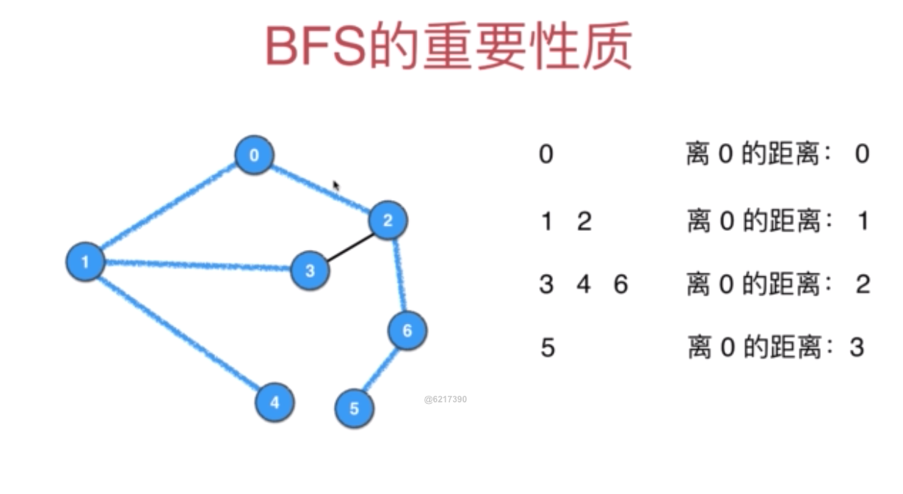 

无权图的最短路径

[USSSPath](https://github.com/HuichuanLI/play-with-graph-algorithme/blob/master/src/USSSPath.java)

## 比较BFS 和 DFS 

图的广度优先遍历BFS 

无权图的最短路径

 

其实很相似，无非就是修改stack 和 queue

其实也可以用随机使用其他模型，比如随机队列。

## 图论建模

算法笔试中图论问题的书写

###  leetcode 785

[785](https://github.com/HuichuanLI/play-with-graph-algorithme/blob/master/src/leetcode785.java)

### leetcode 695

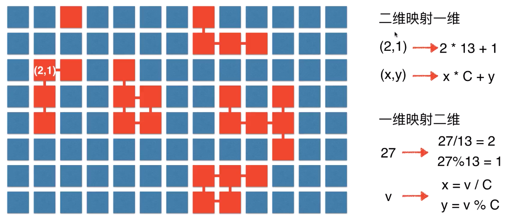 

四联通 ： 四个方向[[-1,0],[0,1],[1,0],[0,-1]]

    x,y
    for(d = 0;d <4;d++){
        nextx = x + dist[d][0]
        nexty = y + dist[d][1];
    }

Floodfill 算法

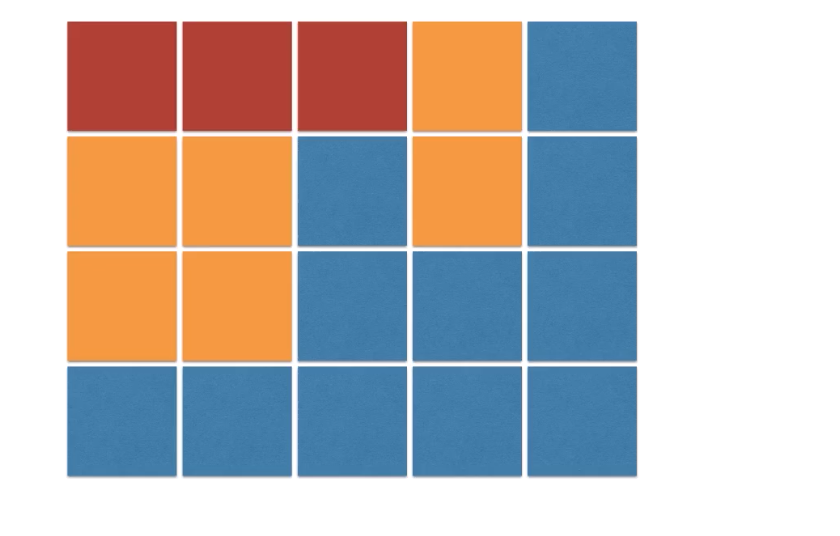 

其实就是从一个点就是遍历，到所有的匹配算法。

更多的应用：填色问题

魔棒其实就是：floodfill 算法

leetcode 200 岛屿的数量

leetcode 1020 飞地的数量

leetcode 130 

leetcode 733 图像处理

leetcode 1034 边框着色

leetcode 529 扫雷

leetcode 827 最大人工岛

关于leetcode 659 号问题的研究。 

我们可以更加优化，我们不需要visited 数组。
    
# 人工智能和图论搜素

leetcode 1091

BFS , 八联通
[1091](https://github.com/HuichuanLI/play-with-graph-algorithme/blob/master/src/leetcode1091.java)

leetcode 752 Open the Lock

一道智力题

有两个水桶，一个装5升，一个装3升。 怎么利用这两个水桶，得到4升水？

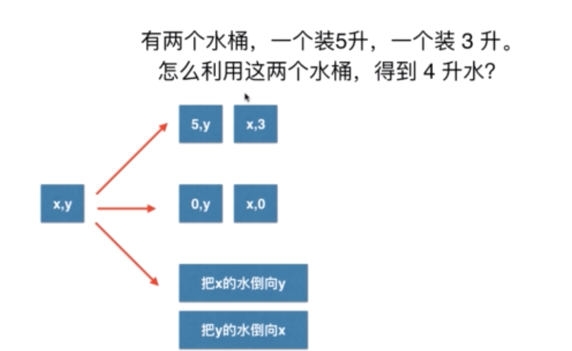 

状态压缩 10 *x + y

[WaterPuzzle](https://github.com/HuichuanLI/play-with-graph-algorithme/blob/master/src/WaterPuzzle.java)

 

# 桥

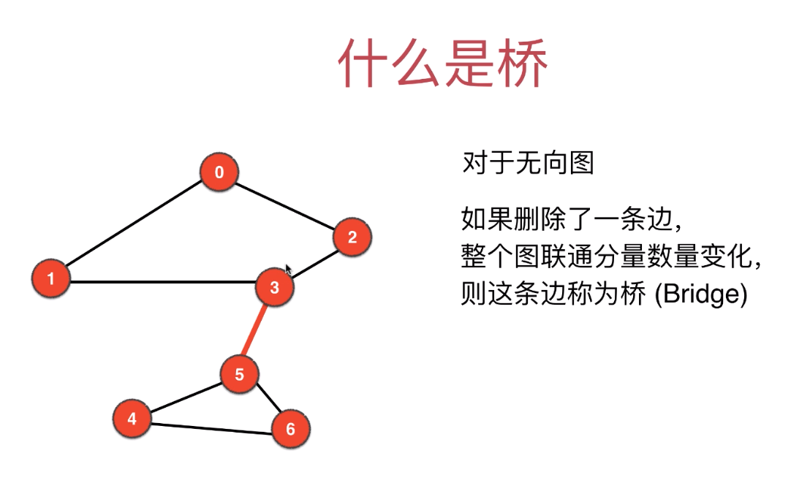 

让我们一定能保证的话，可以能够保证两个联通分量，相互链接。

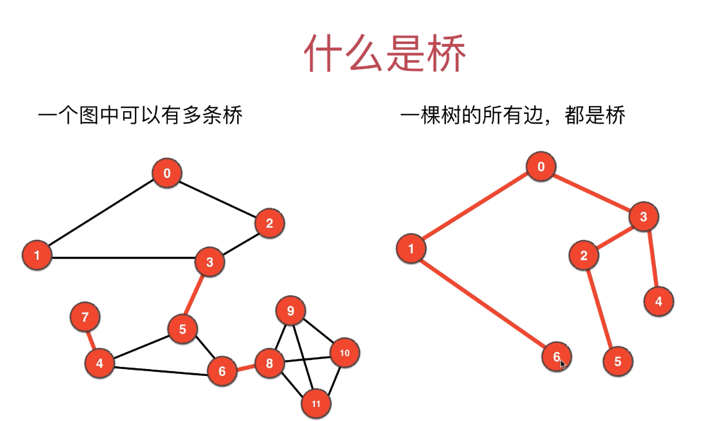 

 

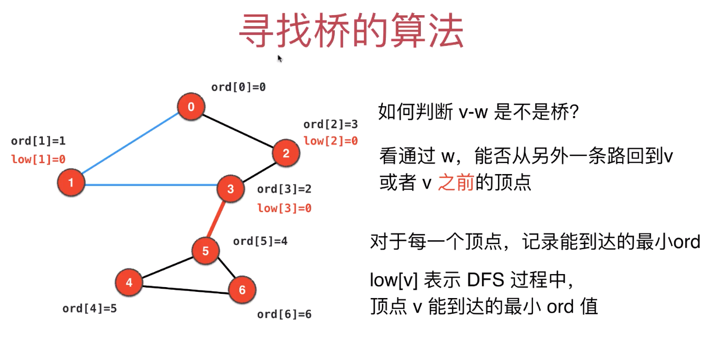 

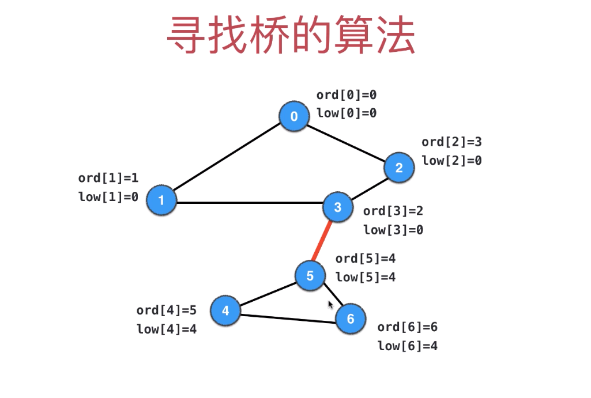 

