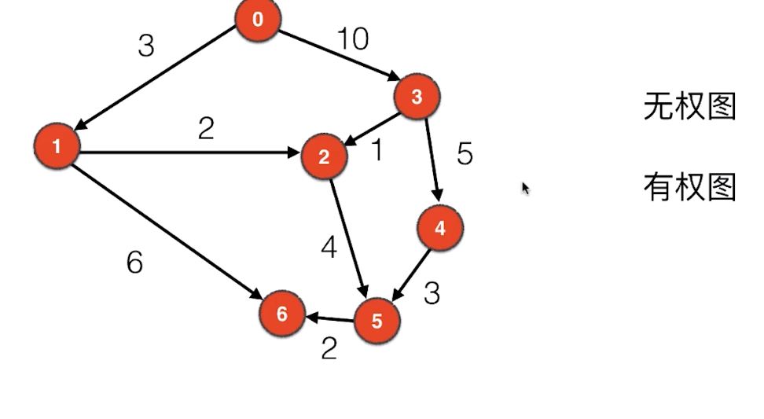
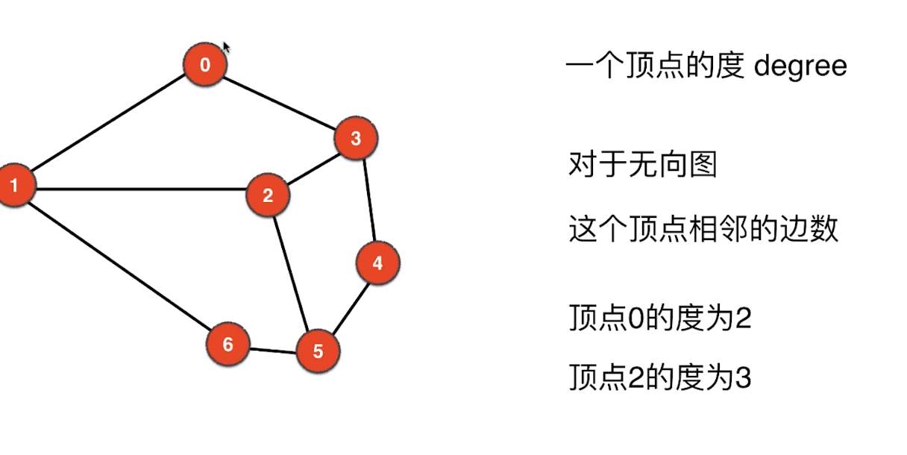
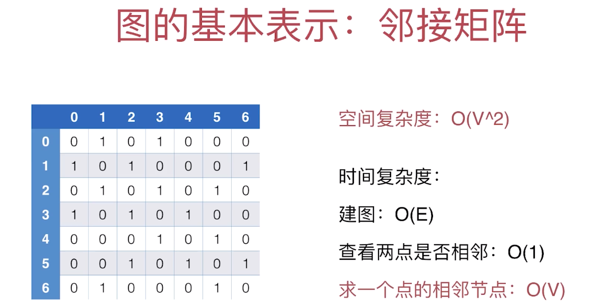
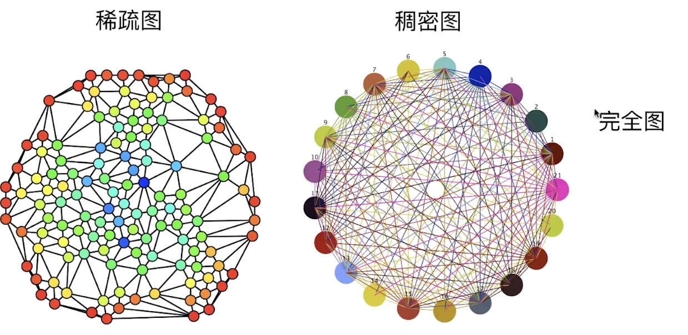
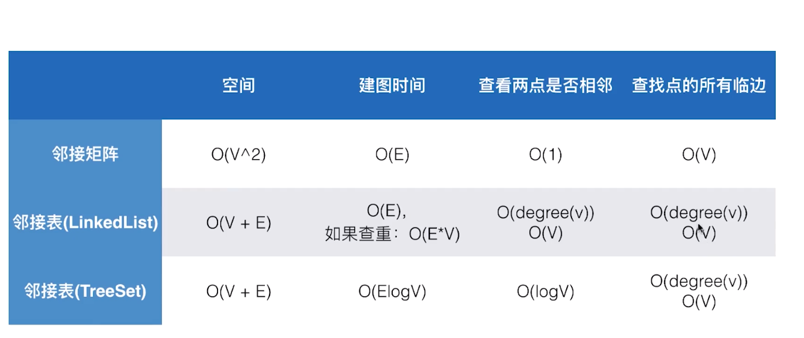
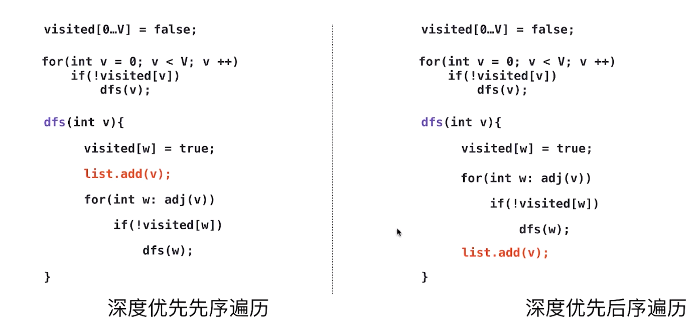

# play-with-graph 玩转图论算法
##  第一个问题关于图的表示

# 图的表示
	

## 社交网路

## 图的分类算法
无向无权图 
无向有权图 
有向无权图 
有向有权图

# 图的基本概念
## 	无向无权图

没有自环边，没有平行边， 称为简单图

### 联通分量 
	一个图的所有节占不一定全部相连 
	一个图可能有多个联通分量

###  无环图 
	树是一种无环图。无环图不一定是树
	联通的无环图就是树

## 包含所有顶占边数V·1， 一定是联通图的生成树吗？

	不是！

###  一个图一定有生成树吗？

	没有

### 一个顶点的度 

##  邻接矩阵

[实现code](https://github.com/HuichuanLI/play-with-graph-algorithme/blob/master/src/AdjMatrix.java)

复杂度

	可以优化空间复杂度 O(V2)
	如果一个图有3000个节点
	空间：5999vs3000^2约1000万 
	求相邻顶点．degree(v)vs3000

## 稀疏图和稠密图

稠密图

平均每个度比较最大的度
## 邻接表

[实现code](https://github.com/HuichuanLI/play-with-graph-algorithme/blob/master/src/AdjList.java)

## 空间复杂度
	空间复杂度，O(V+E)
	如果是 树的话 O（2E+1）= O(E)
	如果是完全图的话 O（v*(V-1)/2 + E）= O(E)
	但是 不能写O(E) 如果不联通

## 时间复杂度：
建图：O(E*V)  和邻接矩阵 相差了v
	
看两点是否相邻 ：O(degree(v))  原来是O(1)

求一个点的相邻节点 : O(degree(v)) 只需要遍历所有相邻节点个数
	
快速查重 
	
快速查看两点是否相邻
	
不要使用链表 
	
hash 表 HashSet O(1)
	
红黑树 TreeSet O(logv)
	
因为红黑树 考虑到元素之间的顺序性，为了保证TreeSet，为了使得结果相对可视化。

红黑树相对于hash表内存空间相对于少。

时间复杂度虽然会增加 o(1) < o(logn) < o(n) 比如 100w 1< 20 < 1000000

算法优化 使用红黑树而对于java使用[TreeSet](https://github.com/HuichuanLI/play-with-graph-algorithme/blob/master/src/AdjSet.java)

## 算法复杂度

我们可以看出来邻接表，在其他方面都是优于其他的表示方法。

所以我们接下来，都是使用邻接表。基于TreeSet。

# 图的遍历

	
图是一种数据结构 每种数据结构，都必须有“遍历"的方式

比如树的遍历: 

很多算法本质就是遍历，其实看算法中是否有关。

其实80%的面试问题都可以解决了。

图其实就是比树要解决，重复遍历的问题。每次需要记录，那个节点被遍历。

图论不考虑非递归算法。

其实图论算法都是从树的遍历的引申，其实很像，其实底层实现很想。

其实对应n叉树，很像。

代码[DFS](https://github.com/HuichuanLI/play-with-graph-algorithme/blob/master/src/GraphDfs.java)

回归二叉树的遍历

类似的 我们可以推导后续遍历

复杂度 O（V+E）

关于优先遍历的应用：二分图

非递归的手法，深度优先遍历，其实很难，邻接矩阵的深度优先遍历

邻接表的深度优先遍历，其实一样。无非就是改变接口，但是注意时间复杂度: O(V^2)

因为这个过程，我们依然要遍历所有顶点的所有邻边。但是遍历一个顶点的所有邻边的时候，要遍历所有的顶点，复杂度是O(V)的，而非O(degree(v))的。

因此，整体，遍历所有顶点的所有邻边，需要的时间复杂度是O(V^2)的。

代码实现 